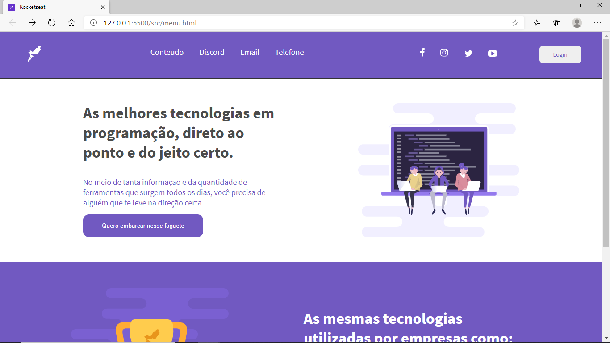
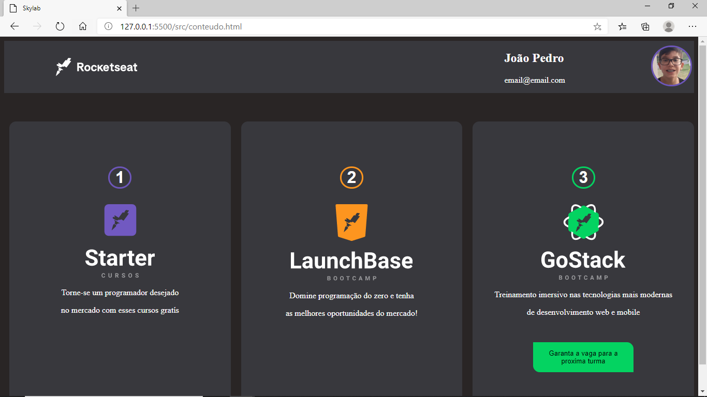

<h1 align="center">🚀Rocketseat UI clone</h1> 

## UI clone do site da [Rocketseat](https://rocketseat.com.br)




## Tecnologias utilizadas:
* Html
* Css
### Em breve...
* Node.js
* Express
* Nodemon
* nunjucks

## Apresentação
Esse projeto não tem **fins Lucrativos**, apenas para aprimorar o conhecimento de certas tecnologias como html, css, node.js, express, nodemon e nunjucks.

# Requisitos & Instalação
## Requisitos
Para você baixar o UI-clone você precisa dos seguintes programas:

* [Vscode](https://code.visualstudio.com/)
* [Node.Js](https://nodejs.org/en/) (Recomendado versão 12v ou superior.)
* [Git bash](https://gitforwindows.org/)(Nas distro Linux e no MacOS já vem instalado o git!)

## Instalação

Após de ter todos os requisitos ,para você instalar precisa dar o seguinte comando no seu terminal
```bash
git clone https://github.com/jpBrabo/rocketseat-ui-clone.git
``` 
1. Após dar este comando abra a pasta dos arquivos no Vscode
1. Instale o [Live Server](https://marketplace.visualstudio.com/items?itemName=ritwickdey.LiveServer) e clique em qualquer arquivo html com o botão direito e aperte "Open with Live Server"

Pronto, Agora você pode ver como ficou o UI-clone do site da rocketseat!!!

Se gostou do projeto deixa a sua estrela e o follow :3

**Feito para estudo de html e css! Todos os direitos reservados jpbrabo-2020**